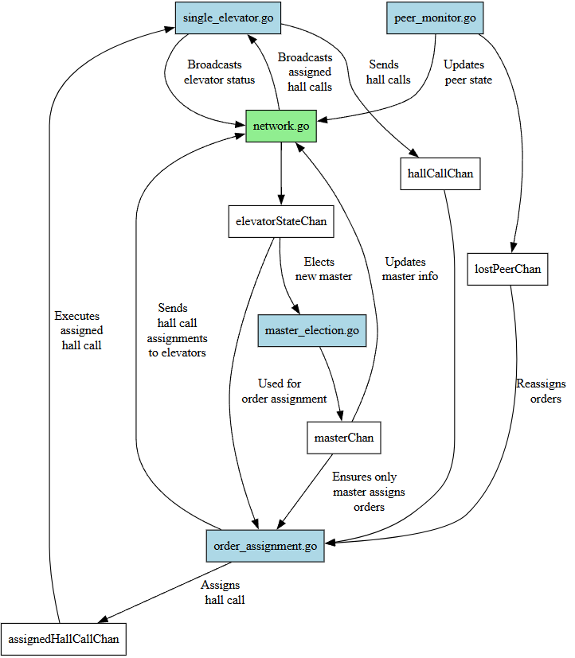
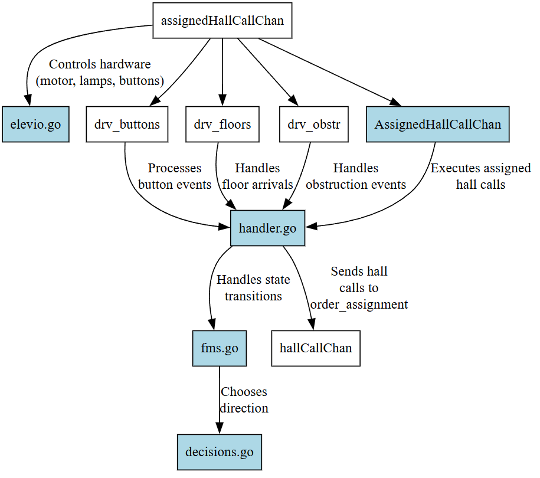

### **Elevator-Project**
TTK4145 Sanntidsprogramering

## **Overview**
This project implements a **multi-elevator system** that can:
- **Process cab and hall calls** efficiently.
- **Assign orders dynamically** using an election-based master system.
- **Detect network failures** and **reassign lost orders** automatically.

The system is built using **Go** and follows a **modular architecture** with clear communication between modules using **Go channels**.

---

## **Project Structure**
| **Module**           | **Description** |
|----------------------|----------------|
| `main.go`            | Initializes the system, sets up channels, and starts goroutines. |
| `single_elevator.go` | Handles individual elevator logic (cab calls, movement, state transitions). |
| `order_assignment.go` | Assigns hall calls based on elevator states and reassigns lost orders. |
| `master_election.go` | Elects a master elevator and ensures consistent master updates. |
| `peer_monitor.go`    | Monitors connected elevators and detects failures. |
| `network.go`         | Handles peer communication and broadcasts elevator states. |
| `config.go`          | Defines shared configurations and constants. |

---

## **Architecture**

- **Master-Slave Model:**
The system operates in a master-slave configuration. One elevator is elected as the master, which is responsible for handling hall call assignments and order distribution. Other elevators act as slaves, executing assigned hall orders.

- **Master Election:**
If the current master goes offline, a new master is elected based on a predefined election algorithm (e.g., choosing the elevator with the lowest ID).

- **Communication Protocol:**
All elevators communicate using UDP broadcasting, ensuring that network messages such as peer updates, master elections, and order assignments are efficiently shared.

---

## **Communication Overview**
The system is built around **Go channels**, which handle all inter-module communication.

- **Hall calls** from `single_elevator` → Sent to `order_assignment`via `hallCallChan`
- **Assigned hall calls** → Sent back to `single_elevator` for execution: 
	- If this elevator is chosen: via `assignedHallCallChan`
	- If another elevator is chosen: via `network.go`
- **Elevator states** → Broadcasted via `network.go` through `elevatorStateChan` to:
	- **Elect master** in `master_election`
	- **Select an elevator** in `order_assignment` for hall calls
- **Master election updates** → Sent to `order_assignment` via `masterChan` to ensure only the master assigns orders.
- **Lost peer detection** -> Sent to `order_assignment` via `lostPeerChan` to reassign lost orders

---

## **Setup and Running the Project**

Set up environment variables:

- **Windows PowerShell**
	- $env:ELEVATOR_PORT="15657"
	- $env:ELEVATOR_ID="elevator_1"

- **Linux (or macOS)**
	- export ELEVATOR_PORT="15657"
	- export ELEVATOR_ID="elevator_1"

To start the elevator system:
- go run main.go

## **Single Elevator Overview**
