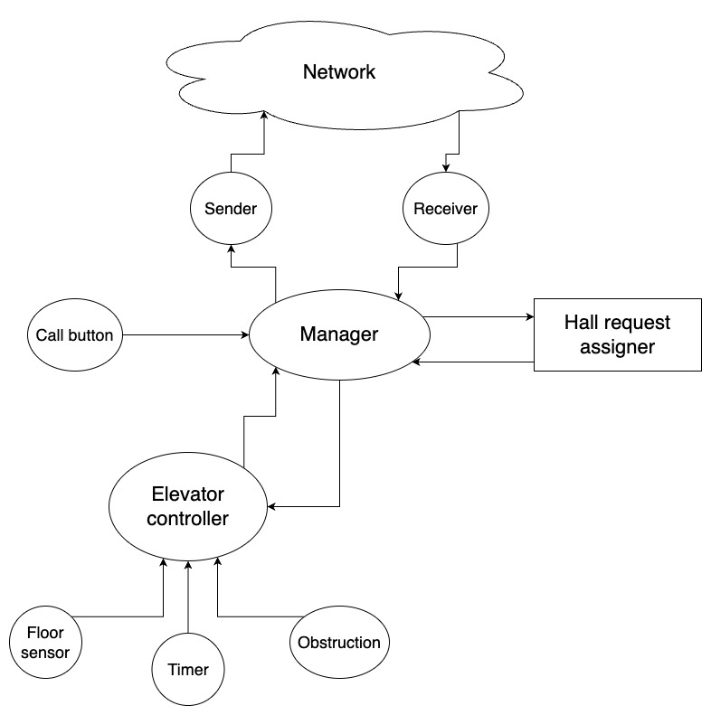

# Elevators project

## How to test it in local

Before to run the Docker compose, run 3 simulators in 3 terminal windows, so you can check the status of each elevator.

Each elevator has a different port number. We have defined the port numbers in the `docker-compose.yml` file: `15657`, `15658` and `15659`.

To build the Docker containers, be careful to set `host.docker.internal` as a IP, instead of `localhost`. 

To build and execute all the containers at the same time, run the following command:
```bash
docker-compose up --build
```

## Structure of the project



- Sender: the thread which has the responsibility to send the messages. The messages are sent to the network to all the other elevators. It has a communication channel for each elevator. The messages must have a predetermined structure which contains:
  - ID of the machine, to identify which elevator sent the message
  - Status of the elevator, which can be idle, moving or door open
  - Direction of the elevator, which can be up or down
  - Current position of the elevator, that is the floor, but if it is in the middle is –1
  - Obstructed or not
- Receiver: the thread which has the responsibility to receive the messages from the network. It has one communication channel which receives all the messages.
- Call button: the thread which is responsible for detecting if the button in the cabin is pressed or not.
- Floor sensor: it is a thread which periodically detects the current position of the elevator.
- Timer: this thread starts a timer when the elevator stops on a floor.
- Obstruction: this thread detects if the obstruction is active or not and it informs the elevator controller.
- Elevator controller: it is the thread which interacts and receives messages from the floor sensor, the timer and obstruction thread. It has the responsibility to turn on and off the lights of the floors.
- Manager: this is the main thread of the elevator. It sends and receives messages across the network thanks to the respective threads. It receives messages from the call button thread in order to detect if a button in the cabin is pressed or not. It executes the hall request algorithm to serve the request and then it communicates with the elevator controller 

  The Hall Request Algorithm works as follows:

- When a call button is pressed, the manager identifies an unassigned hall request.
- It collects all the information about every elevator (position, direction, state) and the previous pending requests.
- Then it distributes the request. It continuously re-evaluates and redistributes all hall requests based on updated elevator states. 
  - The elevators start at 0. 
  - When one elevator wants to serve a request, it sends a “1” to the others. 
  - The other elevators acknowledge (state 1). 
  - When all the confirmations arrive the requesting elevator sends “2”, this means the request is finalized and the elevator can move and serve the request.
